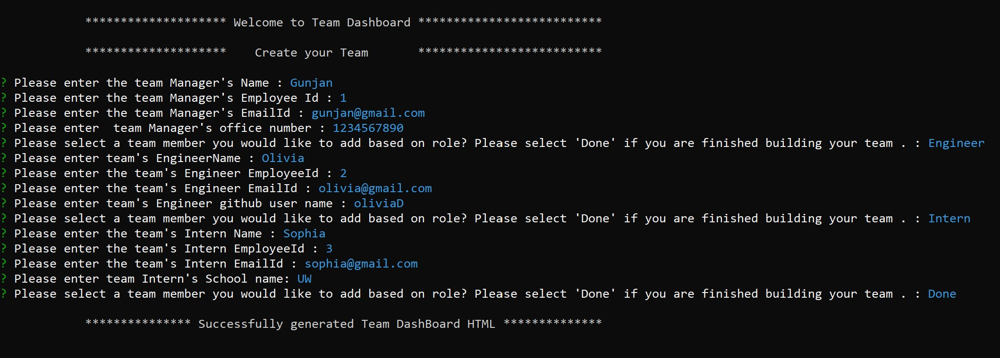
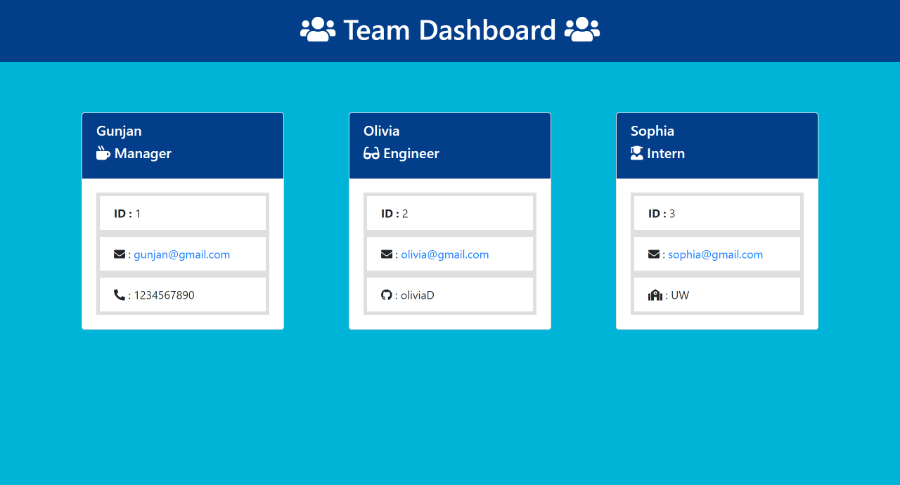
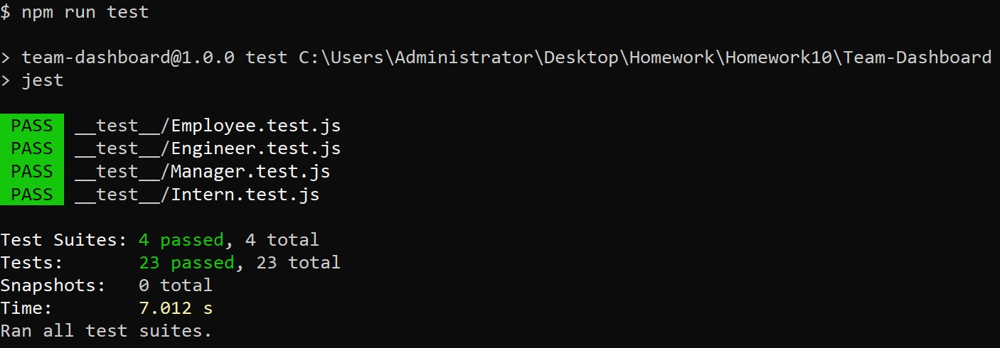

# Team-Dashboard

## Description

This is a Node.js command-line application that takes in information about employees on a software engineering team, then generates an HTML webpage that displays summaries for each person.When application is started the user is prompted to enter the team manager’s name, employee ID, email address, and office number. When user is done with providing information asked, then user is presented with a menu with the option to add an engineer or an intern or to finish building my team. When engineer option is selected, user is prompted to enter the engineer’s name, ID, email, and GitHub username, and taken back to the menu to ask again whether want to add Engineer ,Intern or Done with team.When GitHub username in the HTML page is clicked then GitHub profile opens in a new tab. When intern option is selected, user is prompted to enter the intern’s name, ID, email, and school, and taken back to the menu to ask the same. When Done option is selected by user then user is exited from the application, and the HTML is generated.When an email address in the HTML
is clicked then default email program opens and populates the TO field of the email with the address.
As Testing is key to make code maintainable, unit tests are written for every part of code.

## Key Learning:

1. Javascript.
2. Template literals.
3. Node.js
4. NPM Inquirer Package.
5. Jest JavaScript test framework.
6. Usage of Github (uploading and publishing on github).

## Table of Contents

- [Installation](#Installation)
- [Usage](#Usage)
- [License](#License)
- [Contributors](#Contributors)
- [Tests](#Tests)
- [Technologies](#Technologies)
- [Questions](#Questions)

## Installation

- Clone repo.
- On console run npm install.
- Run the command node index.js
- Required Team Profile will be genetrated under dist folder

## Usage

- Console ScreenShot

  

- Generated Team Profile ScreenShot

  

- Video link

  [Watch Video here](https://youtu.be/mdKnrsRqSDU)

## License

- The application is covered under the license MIT. For more Info please visit [License Info](https://opensource.org/licenses/MIT)

## Contributors

- None

## Tests

- Use command npm run test on terminal to run all tests and use command npm run test Employee on terminal to run all tests in Employee suite.
  - Console ScreenShot
    

## Technologies

- JavaScript
- Node.js
- [NPM Inquirer Package](https://www.npmjs.com/package/inquirer)
- [NPM FS Package](https://www.npmjs.com/package/fs)
- Jest Testing Framework

## Questions

If you have any questions about project you can either contact me or visit my github profile.

Link to my Github: [Github](https://github.com/gunjanb)

Email address :[gunjanbhargava2021@gmail.com](mailto:gunjanbhargava2021@gmail.com)
